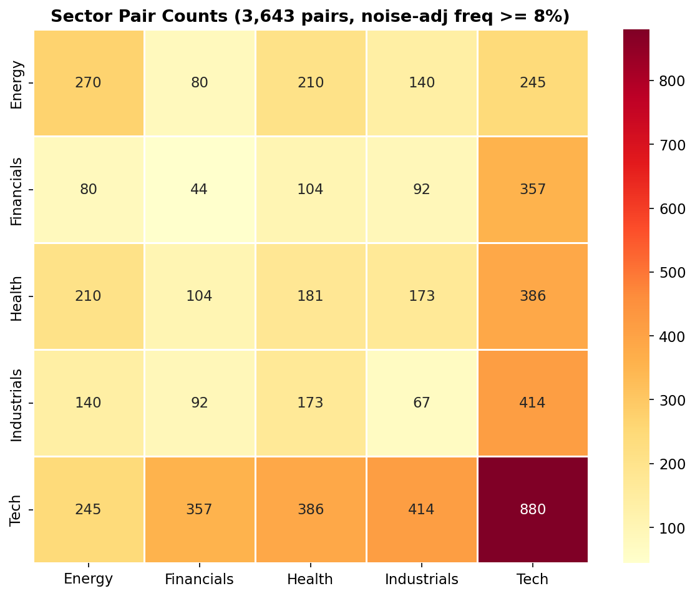
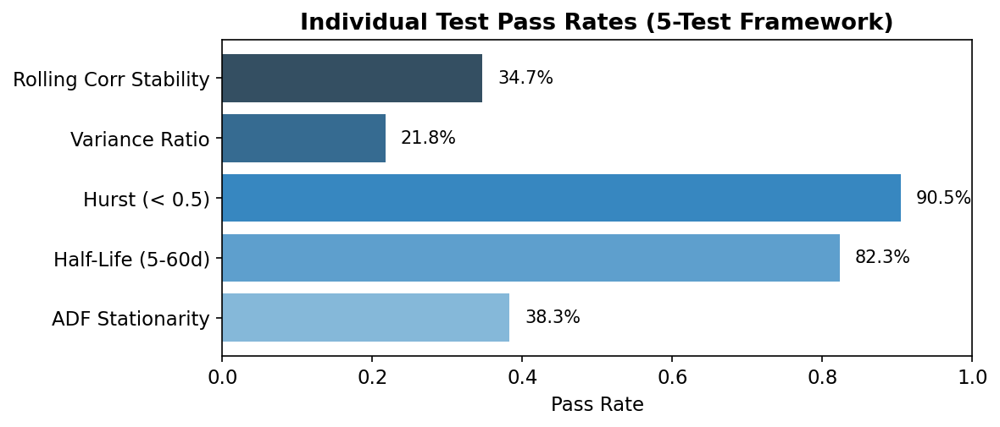
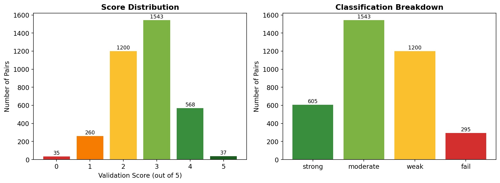
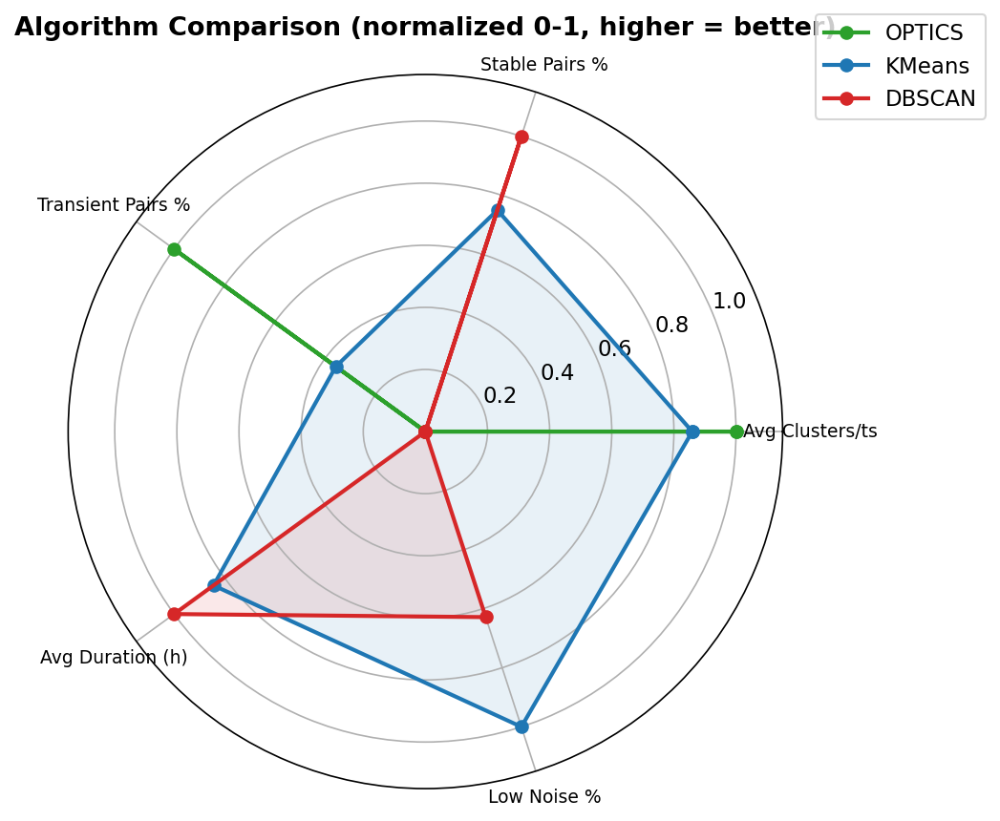
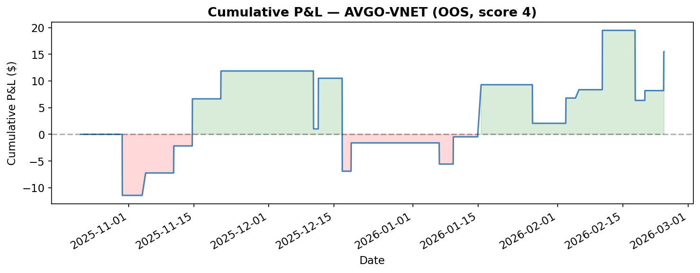

# QUANTT Pairs Trading

A research framework for discovering and trading equity pairs using unsupervised clustering. Instead of starting with cointegration (the traditional approach), this project clusters assets by real-time feature similarity and identifies pairs that consistently land in the same cluster. Those persistently co-clustering pairs are then validated with statistical tests and backtested with z-score mean-reversion strategies.

## Highlights

- **142 tickers** across 5 sectors (Technology, Healthcare, Energy, Financial Services, Industrials)
- **5x lift** over random baselines — clustered pairs pass validation at 4.0% vs 0.8% for random
- **3,643 pairs** passed the 8% noise-adjusted frequency threshold
- **940 statistically significant** pairs via permutation testing (Z > 1.96)
- **57% profitable** on top 50 pairs in enhanced backtesting (Kalman hedge ratios, optimized z-scores, 10bps costs)

## Key Distinctions

**Transient correlation vs cointegration:** Cointegration assumes a permanent equilibrium. Transient correlations form and dissolve over hours to weeks. Cointegration tests correctly reject transient data (0% pass rate in Phase 1). The 5-test framework was designed to capture short-term mean-reversion properties that transient pairs *can* exhibit.

**Method validation vs trading:** The transient validation (Path A) uses backward-looking data to prove clusters find real relationships. It has look-ahead bias by design and is not a trading strategy. The trading pipeline (Path B) uses clustering only as a screening tool, then runs proper calibration/OOS splits on full price history.

**Noise-adjusted frequency:** OPTICS labels most observations as noise. Raw co-cluster frequency divided by total timestamps drastically underestimates how often pairs genuinely co-cluster. The noise-adjusted metric uses only timestamps where both tickers are non-noise as the denominator.

## Results

### Phase 1: Semiconductors (40 tickers)

- 3 clustering algorithms compared (OPTICS, KMeans, DBSCAN)
- 8 consensus pairs identified across all algorithms (e.g., ADI-NXPI, AMAT-KLAC, KLAC-LRCX)
- Transient validation: **5.0x lift** over random (4.0% clustered pass rate vs 0.8% random)
- 11 pairs statistically significant via permutation testing (Z > 1.96)
- 14/26 tradeable pairs profitable out-of-sample (no transaction costs), top Sharpe 3.55

### Phase 2: Cross-Sector (142 tickers, 5 sectors)

- Systematically screened universe: Technology, Healthcare, Energy, Financial Services, Industrials
- 3,643 pairs passed the 8% noise-adjusted frequency threshold
- **59% tradeable** (score >= 3 on the 5-test framework)
- 605 strong pairs (score 4-5), 1,543 moderate (score 3)
- Baseline backtest (no transaction costs): **41% profitable** across all 2,148 tradeable pairs
- Enhanced backtest on top 50 pairs (Kalman hedge ratios, optimized z-scores, 10bps costs): **57% profitable**
- 940/3,539 pairs statistically significant via permutation testing

## Visuals


*Cross-sector pair counts — Technology dominates with 880 intra-sector pairs; cross-sector pairs appear in every combination.*


*Individual pass rates for the 5-test scored validation framework. Hurst and half-life are easy to pass; ADF, variance ratio, and rolling correlation stability are the binding constraints.*


*Left: validation score histogram (0-5). Right: classification breakdown — 605 strong, 1,543 moderate, 1,200 weak, 295 fail.*


*OPTICS vs KMeans vs DBSCAN on Phase 1 semiconductor data. OPTICS finds the most transient pairs; KMeans has the lowest noise rate; DBSCAN is a middle ground.*


*Out-of-sample cumulative P&L for a top-scoring pair — baseline backtest with OLS hedge ratio, z-score entry at 2.0, exit at 0.5, no transaction costs.*

## Core Idea

1. Compute 9 features per asset per hour (volatility, market/sector beta, RSI, momentum, regime shifts)
2. Cluster assets at every timestamp using OPTICS (StandardScaler -> PCA -> OPTICS)
3. When two assets land in the same cluster, a **transient correlation** has formed
4. Most are short-lived. But some pairs co-cluster *repeatedly* across many timestamps
5. Those persistent pairs are validated on their full price history and backtested out-of-sample

The project has two distinct paths:

- **Method validation** proves the clusters detect real relationships (5x lift over random baselines)
- **Trading pipeline** uses clustering purely as a screening tool, then applies standard pairs trading methodology (hedge ratios, z-score signals, walk-forward backtesting) to persistent pairs

## Pipeline

### How Pairs Are Discovered

```
Hourly Prices -> 9 Features per Ticker -> StandardScaler -> PCA (90% var) -> OPTICS
                                                                                |
                                                                    Cluster labels per timestamp
                                                                                |
                                                              Count co-cluster frequency per pair
                                                                                |
                                                              Noise-adjusted frequency filter
                                                                (Phase 1: >15%, Phase 2: >8%)
                                                                                |
                                                                        Pair Registry
```

**Noise-adjusted frequency** fixes a denominator problem: OPTICS labels ~58% of observations as noise. Instead of dividing co-cluster count by total timestamps (misleading), it divides by timestamps where *both* tickers are non-noise (accurate).

### How Pairs Are Validated

**Phase 1 (3-criteria classical test):**
Cointegration (p < 0.05) + half-life (5-60 days) + Hurst exponent (< 0.5). Must pass all 3. Cointegration had a 0% pass rate on transient data, motivating the Phase 2 framework.

**Phase 2 (5-test scored framework):**

| Test | Threshold | Pass Rate |
|------|-----------|-----------|
| ADF stationarity | p < 0.10 | 38.3% |
| Half-life | 5-60 days | 82.3% |
| Hurst exponent | H < 0.5 | 90.5% |
| Lo-MacKinlay variance ratio | VR < 1, p < 0.10 | 21.8% |
| Rolling correlation stability | stability > 0.5 | 34.7% |

Score >= 4 = strong, 3 = moderate, 2 = weak, 0-1 = fail. Pairs scoring >= 3 are considered tradeable.

### How Pairs Are Traded

Z-score mean-reversion on the OLS spread (`spread = price_A - beta * price_B`):

- Hedge ratio estimated on calibration data only (67%), fixed for out-of-sample (33%)
- Long entry: z <= -2.0 | Short entry: z >= 2.0 | Exit: |z| <= 0.5
- Walk-forward validation: 5 rolling cal/OOS splits
- Baseline backtest does not include transaction costs.

Enhanced backtest adds: grid-searched z-score parameters, Kalman terminal beta (run on calibration only, no look-ahead), and 10bps transaction costs per trade.

## Features Computed per Ticker

| Feature | Window | Description |
|---------|--------|-------------|
| Returns | 1h | Hourly percentage return |
| Vol_Short | 50h | Short-term rolling volatility |
| Beta_SPX_Short | 50h | Market beta (vs S&P 500) |
| Beta_Sector_Short | 50h | Sector beta (leave-one-out) |
| RSI | 70h | Relative Strength Index (Wilder's smoothing) |
| Momentum_5H | 5h | 5-hour price momentum |
| Vol_Regime_Shift | 50h/147h | Short vs medium volatility (normalized difference) |
| Beta_SPX_Regime_Shift | 50h/147h | Short vs medium market beta difference |
| Beta_Sector_Regime_Shift | 50h/147h | Short vs medium sector beta difference |

## Repository Structure

```
TransientCorrelation/
    config.py                   All thresholds as frozen dataclasses
    validation/                 Hedge ratios, z-scores, P&L simulation, permutation testing
    signals/                    9-feature computation and OPTICS clustering pipeline
    trading/                    Phase 1 backtesting (walk-forward, noise-adjusted frequency)
    screener/                   Phase 2 cross-sector analysis (5-test framework, enhanced backtest)
    research/                   Phase 1 notebooks (40 semiconductor tickers)
    screener/notebooks/         Phase 2 notebooks (142 tickers, run 01→05 in order)
    tests/                      pytest suite
    scripts/                    Figure generation
```

> **Full file-by-file breakdown:** [FILE_GUIDE.md](TransientCorrelation/FILE_GUIDE.md) | **Architecture deep-dive:** [PROJECT_GUIDE.md](TransientCorrelation/PROJECT_GUIDE.md)

## Configuration

All thresholds live in `TransientCorrelation/config.py` as frozen dataclasses:

- `ClusteringConfig` — OPTICS parameters (min_samples=3, xi=0.05, PCA 90% variance)
- `FeatureConfig` — Feature windows and which features to cluster
- `TransientConfig` — Transient validation windows and thresholds
- `ValidationConfig` — Pair validation parameters
- `BacktestConfig` — Backtest lookback, entry/exit z-scores, cal/OOS split
- `FormationConfig` — Formation/dissolution detection parameters
- `PipelineConfig` — Aggregates all configs, plus global thresholds

Screener-specific config is in `TransientCorrelation/screener/config.py`:
- $2B+ market cap, 5M+ daily volume, $5+ price, positive EBITDA
- 5 sectors: Technology, Healthcare, Energy, Financial Services, Industrials

## Setup

```bash
cd TransientCorrelation
python -m venv .venv
source .venv/bin/activate
pip install -r requirements.txt
```

> **Two requirements files:** `TransientCorrelation/requirements.txt` (14 packages) contains core dependencies for the pipeline and notebooks. The root `requirements.txt` (24 packages) includes extras like streamlit, vectorbt, and arch that are not required for the core pipeline.

**Run tests:**
```bash
pytest tests/
```

**Run Phase 1 notebooks:**
```bash
jupyter notebook research/
# Run: optics-clustering.ipynb -> optics-signals.ipynb
# Optional: KMeans.ipynb, DBScan.ipynb -> algorithm-comparison.ipynb
```

**Run Phase 2 notebooks:**
```bash
jupyter notebook screener/notebooks/
# Run in order: 01 -> 02 -> 03 -> 04 -> 05
```

Notebooks generate pickle artifacts in `research/data/` and `screener/data/` (not tracked in git).

**Generate README figures:**
```bash
python scripts/generate_figures.py
# Requires notebook artifacts to exist; outputs to docs/figures/
```

## Dependencies

Python >= 3.10

numpy, pandas, scipy, statsmodels, scikit-learn, yfinance, matplotlib, seaborn, plotly, pykalman, pandas-ta-classic, yfscreen, pytest, jupyter

## Documentation

- **[FILE_GUIDE.md](TransientCorrelation/FILE_GUIDE.md)** — Detailed per-file documentation covering every module, its purpose, and key functions
- **[PROJECT_GUIDE.md](TransientCorrelation/PROJECT_GUIDE.md)** — Deep-dive into the project architecture, design decisions, and data flow
