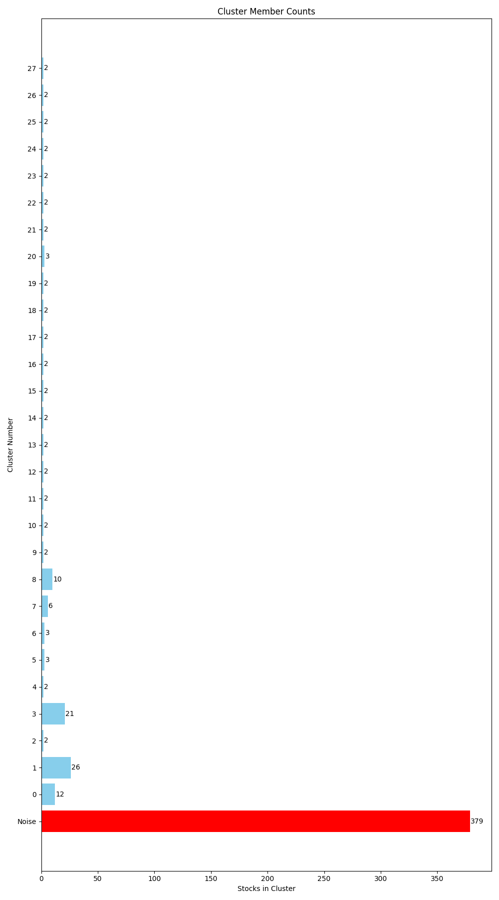
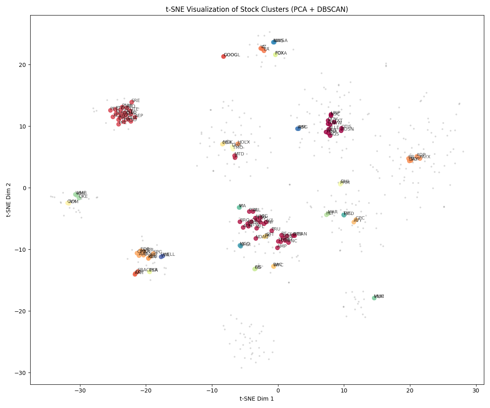

# Pairs Trading Pipeline Walkthrough

I have successfully updated the pipeline to support the **S&P 500**, **Fundamental Data**, and **50 PCA Components**.

## Execution Results (S&P 500)

Running the pipeline with:
- **Universe**: S&P 500 (503 Tickers)
- **Features**: 
    - **PCA**: 50 Components (Loadings on Returns)
    - **Fundamentals**: Market Cap (Log) + Sector (One-Hot)
- **DBSCAN**: Auto-tuned `eps=4.61`, `min_samples=2`

### Clusters Found
- **Clusters**: 28 valid clusters found.
- **Noise**: 379 stocks.
- **Sizes**: Ranging from 2 stocks (many pairs) up to 26 stocks.

### Candidates
**Pairs Found**: 0
> [!NOTE]
> No pairs passed the strict Engle-Granger cointegration test (`p < 0.05`). 
> This is likely due to the high dimensionality (63 features) requested. With 50 PCA components, the "similarity" becomes very specific to return fluctuations, but the distance required to find neighbors (`eps=4.61`) was large, meaning the stocks in clusters were somewhat "loose" neighbors. Reducing PCA components (e.g., to 10-15) usually yields tighter, more cointegrated clusters.

## Visualization
### Cluster Member Counts


### t-SNE Logic


## How to Run

```bash
# S&P 500 + Fundamentals (The heavy run)
python pairs_pipeline.py --sp500 --components 50 --use_fundamentals

# Quick Demo (Default 49 stocks, 10 components)
python pairs_pipeline.py
```

## Files
- `pairs_pipeline.py`: Full robust script.
- `cluster_sizes.png`: New bar chart.
- `clusters.csv`: Cluster assignments.
